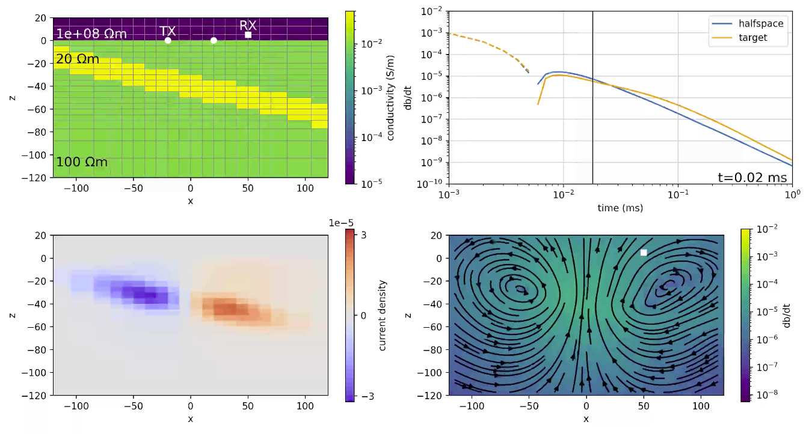

# Advances in open-source software for 3D electromagnetics using SimPEG

*Lindsey J. Heagy, Johnathan Kuttai, Devin Cowan, Joseph Capriotti, Seogi Kang, Dominique Fournier, and Douglas W. Oldenburg*

Presentation given at the 8th International Symposium on Airborne Electromagnetics in 2023.

## Abstract
Open-source software is increasingly being adopted by the geophysics
community. Their emergence has greatly reduced the time required for
students and researchers to be able to implement and explore new ideas,
and having new developments implemented in an open-source project
facilitates technology transfer and collaboration between research and
commercial organizations. SimPEG is an open-source project for
geophysical simulations and inversions. In this abstract, we provide an
overview of the capabilities and recent advancements in SimPEG that are
relevant to the airborne electromagnetics community.

